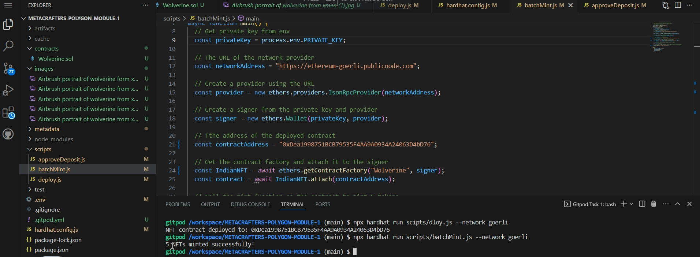
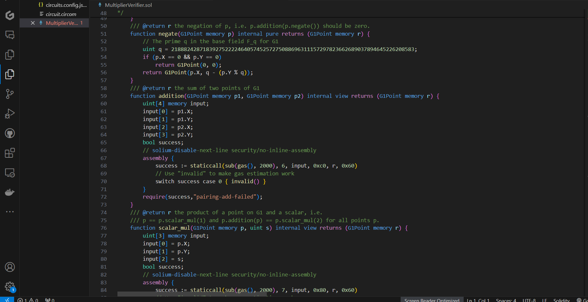

## Description
This repository contains the assignments that is made during the learning process. Files names has been given as the course name to avoid the confusions. Given below are the list of files and courses completed in chronological order:
* [Poly mod 1](https://github.com/Harshh18/Metacrafters_project/tree/main/Poly%20mod%201)
* [Poly mod 3](https://github.com/Harshh18/Metacrafters_project/tree/main/Poly%20mod%203)
## Executing program
Under this section, I will provide you the information of how these codes are getting executed, what's the process and will also provide you the Loom video link for the same.
* Poly Advance Module 1: In this project, I have created a NFT collection which consists of 5 different images as NFTs and I have minted these NFTs in the Goerli Ethereum network and will going to transfer these tokens to the Polygon Mumbai network using the FxPortal bridge. The process have been expplained in this Loom video. [🔗 Loom](https://www.loom.com/share/be911b1cb0ff48f7b336ca473fc91c10?sid=c9f79491-70e6-457d-99a2-131477a7ad7e)
* Poly Advance Module 3: This module helps in studying about Zero-knowledge proofs and in this project we implement the working of a circuit provided in the assignment using logic gates implementation. The code walkthrough and working of the project has been explained in this Loom video. [🔗 Loom](https://www.loom.com/share/9ac06ca3215c4b23acea48be62da08e1?sid=b2dc1024-dc4a-4e97-8790-f51ef387d753)

## ScreenShot
## PolyMod1

## PolyMod3

## Author
This repository is under Avanish Yadav.
